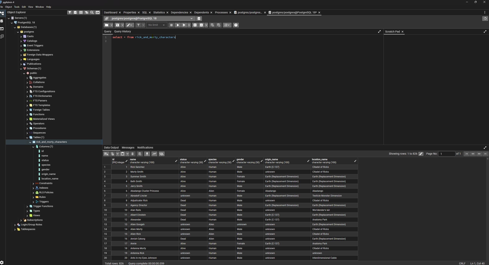

# Rick and Morty API - Carga de dados no PosgreSQL

Este projeto faz a carga de dados dos personagens da série Rick and Morty para um banco de dados PostgreSQL, utilizando Python e pandas.

Abaixo uma imagem da tabela no PosgreSQL


## Objetivo

Automatizar o processo de ingestão de dados de personagens, facilitando análises e visualizações futuras.

## Pré-requisitos

- Python 3.x instalado
- PostgreSQL instalado e rodando localmente
- Bibliotecas Python: `pandas`, `psycopg2`
- Arquivo `rick_and_morty_characters_transformed.csv` na raiz do projeto

## Instalação das dependências

Abra o terminal do VS Code e execute:

```
pip install pandas psycopg2
```

## Configuração do Banco de Dados

1. Crie um banco de dados no PostgreSQL (exemplo: `rickmortydb`).
2. Atualize as credenciais de conexão no arquivo `load.api.py`:

```python
conn = psycopg2.connect(
    host="localhost",
    database="rickmortydb",
    user="seuusuario",
    password="suasenha"
)
```

## Executando o Projeto

No terminal, execute:

```
python load.api.py
```

Se tudo estiver correto, verá a mensagem:

```
Dados carregados no PostgreSQL!
```

## Estrutura da Tabela

A tabela criada no PostgreSQL terá os seguintes campos:

- `id`: Identificador do personagem
- `name`: Nome
- `status`: Status (vivo, morto, desconhecido)
- `species`: Espécie
- `gender`: Gênero
- `origin_name`: Origem
- `location_name`: Localização atual

## Personalização

Você pode adaptar o script para inserir outros campos ou trabalhar com diferentes fontes de dados.

## Licença

Este projeto é livre para uso educacional e pessoal.

## Fluxograma do Funcionamento dos Códigos `.py`


```

> O script lê o arquivo CSV, conecta ao banco, cria a tabela se necessário, insere os dados e finaliza a conexão.

---
Sinta-se à vontade para contribuir ou sugerir melhorias!